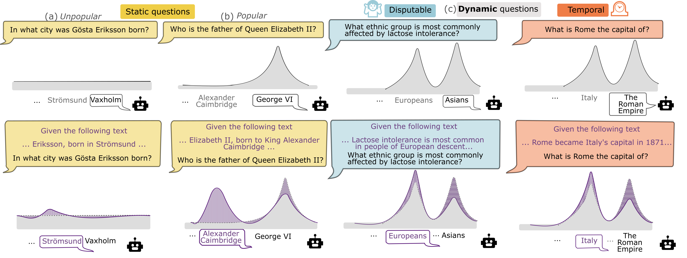

# DYMANICQA

This is a repository for the paper [DYNAMICQA: Tracing Internal Knowledge Conflicts in Language Models](https://arxiv.org/abs/2407.17023) accepted at Findings of EMNLP 2024.

  

Our paper investigates the Language Model's behaviour when the conflicting knowledge exist within the LM's parameters. We present a novel dataset containing inherently conflicting data, DYNAMICQA. Our dataset consists of three partitions, **Static**, **Disputable** 🤷‍♀️, and **Temporal** 🕰️.

We also evaluate several measures on their ability to reflect the presence of intra-memory conflict: **Semantic Entropy** and a novel **Coherent Persuasion Score**. You can find our findings from our paper!

## Dataset

Our dataset is available under /Data folder.
You can also load our dataset using [huggingface datasets](https://huggingface.co/datasets/copenlu/dynamicqa). 

| Partition | Number of Questions |
| --------- | ------------------- |
| Static   | 2500 |
| Temporal | 2495 |
| Disputable | 694 |

## Code
Our code base provides the implementation of Semantic Entropy and the proposed Coherent Persuasion Score.
